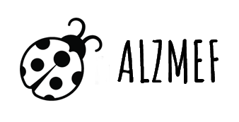

# PROJETO ALZMEF

 

 

:star: Projeto do site institucional da Alzmef Consultoria Ltda.

 

 

## A ALZMEF CONSULTORIA ©

Este é o site institucional da empresa ***fictícia*** **ALZMEF CONSULTORIA** e foi criado exclusivamente para exercitar o conhecimento adquirido em HTML5 e CSS3, em um primeiro momento, e JAVASCRIPT no seu processo de evolução.

As melhorias implementadas no site, como design responsivo (mobile friendly), SEO, UX e opções de acessibilidade são graduais e acompanham a curva de aprendizado com as linguagens de programação web e técnicas do universo front-end.

 

## License

Este projeto está licenciado sob os termos da **MIT License** © [Luciana Muniz Freire](https://br.linkedin.com/in/lumunizf).  
Para mais informações leia o arquivo de [LICENÇA](https://github.com/lumunizf/Test-automation/blob/master/LICENSE).